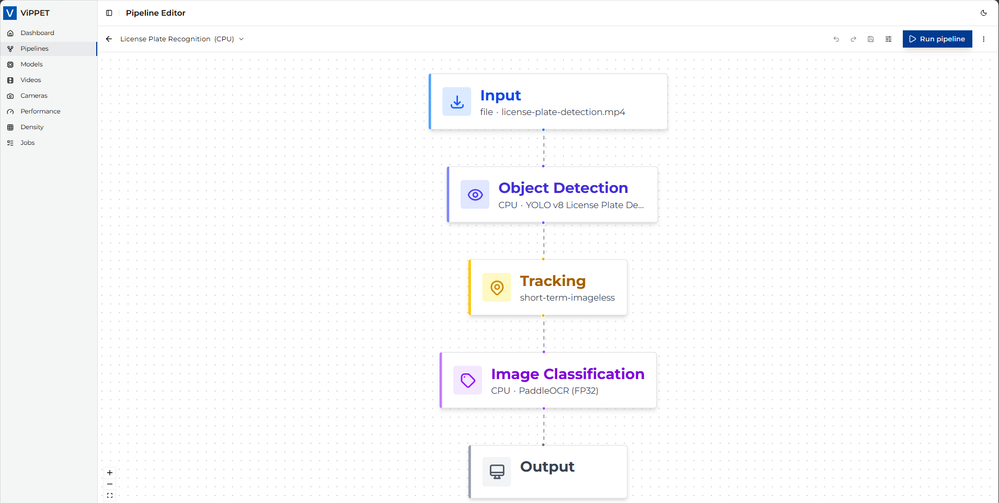
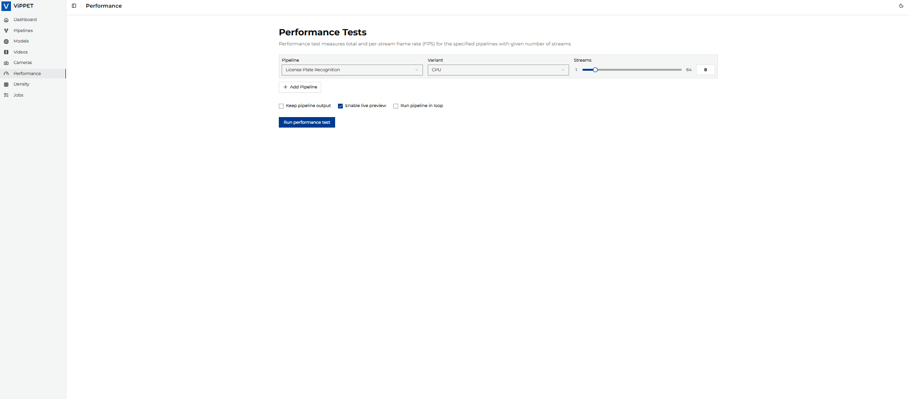
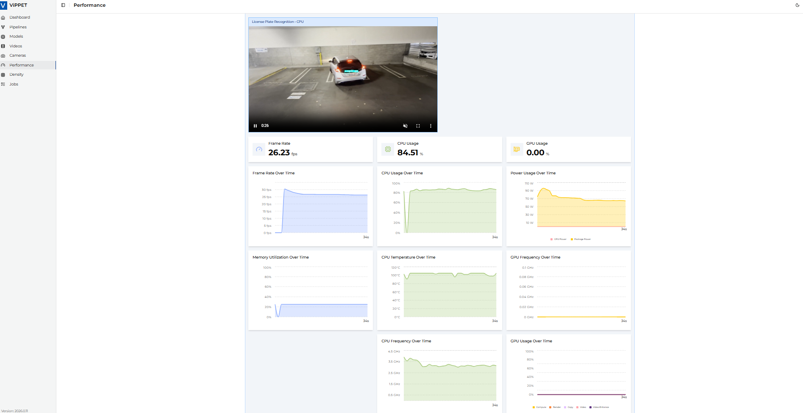
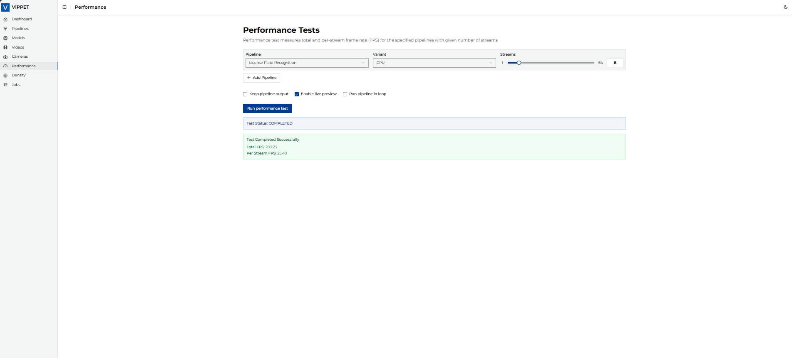
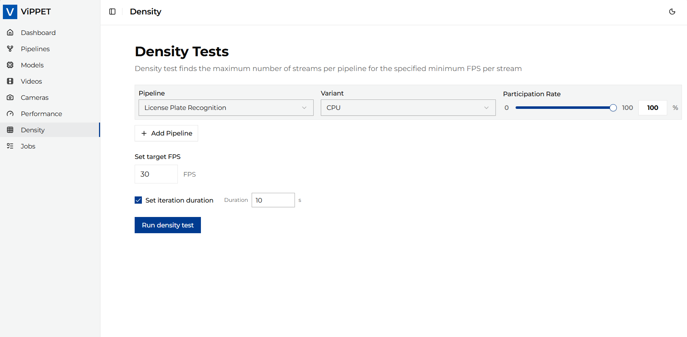
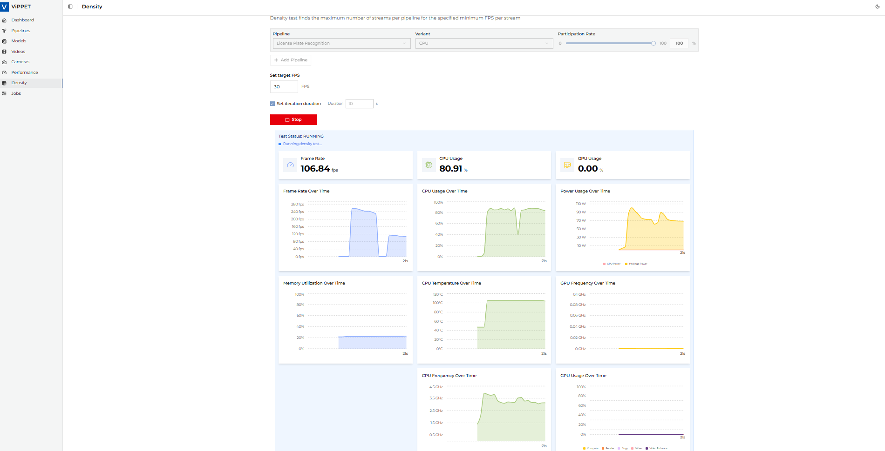
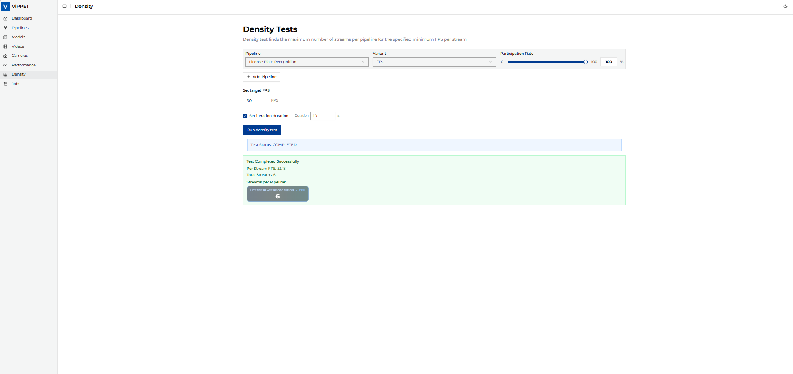

# License Plate Recognition with ViPPET 

License Plate Recognition (LPR) systems have evolved from specialized hardware solutions to
flexible, software-defined pipelines that can adapt to various deployment scenarios.

The Visual Pipeline and Platform Evaluation Tool (ViPPET) introduces a powerful approach to LPR
through its **Simple Video Structurization (D-T-C)** pipeline - a versatile, use case-agnostic
solution that delivers enterprise-grade performance across Intel® hardware platforms.

Unlike traditional LPR solutions that require expensive proprietary hardware, ViPPET's pipeline
architecture leverages GStreamer video processing and OpenVINO™ optimized inference to deliver
superior performance on standard Intel® computing platforms.


*Figure 1: License Plate Recognition pipeline in ViPPET*

## ViPPET's Advanced Pipeline Architecture

### The Simple Video Structurization (D-T-C) Pipeline

ViPPET's LPR solution is built on the proven D-T-C (**Detect-Track-Classify**) methodology:

```yaml
name: License Plate Recognition
definition: >
  The Simple Video Structurization (D-T-C) pipeline is a versatile, use case-agnostic solution that supports
  license plate recognition, vehicle detection with attribute classification, and other object detection and
  classification tasks, adaptable based on the selected model.
tags:
  - Smart Cities
  - Transportation
```

This architecture provides:

- **Modular Design**: Each component can be optimized independently.
- **Hardware Flexibility**: Seamless scaling across CPU, GPU, and NPU.
- **Real-time Processing**: GStreamer-based pipeline for low-latency inference.
- **Production Ready**: Battle-tested components for enterprise deployment.


## Pipeline Component Deep Dive

### 1) Video Ingestion and Decoding

```text
filesrc location=/videos/input/license-plate-detection.mp4 !
decodebin3 !
```

- Hardware-accelerated decoding using Intel® Quick Sync Video.
- Multi-format support (H.264, H.265, VP9).
- Adaptive bitrate handling for network streams.

### 2) Performance Monitoring

```text
gvafpscounter starting-frame=500 !
```

- Real-time FPS tracking with configurable start frame.
- Latency measurement for end-to-end pipeline analysis.
- Resource utilization monitoring integrated with ViPPET dashboard.

### 3) Object Detection

```text
gvadetect
  model=/models/output/public/yolov8_license_plate_detector/FP32/yolov8_license_plate_detector.xml
  model-instance-id=detect0
  device=CPU/GPU/NPU
  pre-process-backend=opencv/va-surface-sharing
  batch-size=0
  inference-interval=3
  nireq=0 !
```

#### Optimization Parameters

- `inference-interval=3`: Process every 3rd frame for efficiency.
- `batch-size=0`: Dynamic batching based on available resources.
- `nireq=0`: Automatic inference request optimization.

### 4) Object Tracking

```text
gvatrack tracking-type=short-term-imageless !
```

- Short-term tracking optimized for license plate scenarios.
- Imageless tracking for reduced memory footprint.
- ID consistency across frame sequences.

### 5) Classification and OCR

```text
gvaclassify
  model=/models/output/public/ch_PP-OCRv4_rec_infer/FP32/ch_PP-OCRv4_rec_infer.xml
  model-instance-id=classify0
  device=CPU/GPU/NPU
  inference-region=roi-list
  reclassify-interval=1 !
```

#### Smart Classification Features

- ROI-based inference for computational efficiency.
- Adaptive reclassification based on tracking confidence.
- Multi-device deployment for load balancing.

### 6) Metadata Processing

```text
gvawatermark !
gvametaconvert format=json json-indent=4 !
gvametapublish method=file file-path=/dev/null !
```

- Visual annotations with bounding boxes and text overlays.
- Structured JSON output for downstream processing.
- Flexible publishing to files, databases, or message queues.


## Conclusion

ViPPET's License Plate Recognition solution represents a paradigm shift in video analytics,
combining the flexibility of software-defined pipelines with the performance of Intel®-optimized
hardware acceleration.

The Simple Video Structurization (D-T-C) architecture provides:

### Key Advantages

- Unmatched Flexibility: Deploy across CPU, GPU, and NPU with identical codebase.
- Production-Ready Performance: GStreamer-based pipeline for enterprise reliability.
- Cost-Effective Scaling: Leverage standard Intel® hardware instead of specialized equipment.
- Future-Proof Architecture: Seamless integration with emerging Intel® technologies.

### Business Impact

- Faster Time-to-Market: Pre-built pipelines accelerate development cycles.
- Operational Excellence: Comprehensive monitoring and automated optimization.

## LPR Test Views in ViPPET

### Performance Test


*Figure 2: LPR performance test configuration*


*Figure 3: LPR performance test execution*


*Figure 4: LPR performance test results*

### Density Test


*Figure 5: LPR density test configuration*


*Figure 6: LPR density test execution*


*Figure 7: LPR density test results*

Whether you're implementing smart parking systems, traffic enforcement solutions, or logistics
automation, ViPPET provides the foundation for building world-class license plate recognition
applications that scale with your business needs.

## Next Steps

You can use the predefined License Plate Recognition pipeline described in this guide,
or configure your own custom pipeline in ViPPET:

- [Configure your own pipeline](./configure-pipelines.md)
- [Build LPR pipeline using API](./license-plate-recognition-api.md)
